# Groupe de nouar_a & rafali_h

## Répartition des taches:

* rafali_h:

Creation des migrations, des models et des seeders.

* nouar_a:

Mise en place des Routes et des Controllers.

* commun:

Lien entre tout les fichiers. Globalement discussion sur la marche à suivre au quotidien.

## Suivi journalier:

### Lundi 1 Mars:

#### Organisation de la semaine, répartition des tâches:

Nous avons decidé de partir sur un travail commun, nous commençons par les utilisateurs,
donc faire le tout en même temps migration, puis models, puis seeder avec route et controller en parallèle.

### Mardi 2 Mars:

#### Objectifs:

Finir le package Utilisateur.

#### Résultats:

* Migration:

* Model:

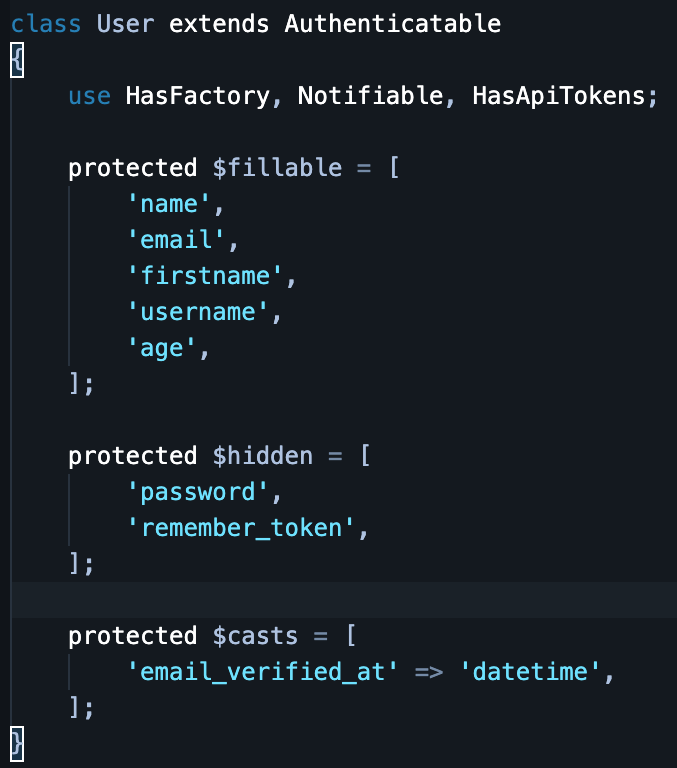

* Seeder:

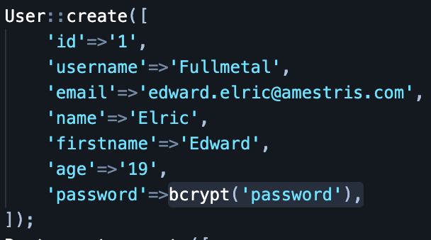

* Route:

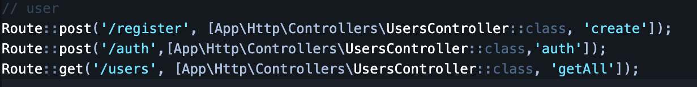

### Mercredi 3 Mars:

#### Objectifs:

Finir le package Restaurant.

#### Résultats:

* Migration:

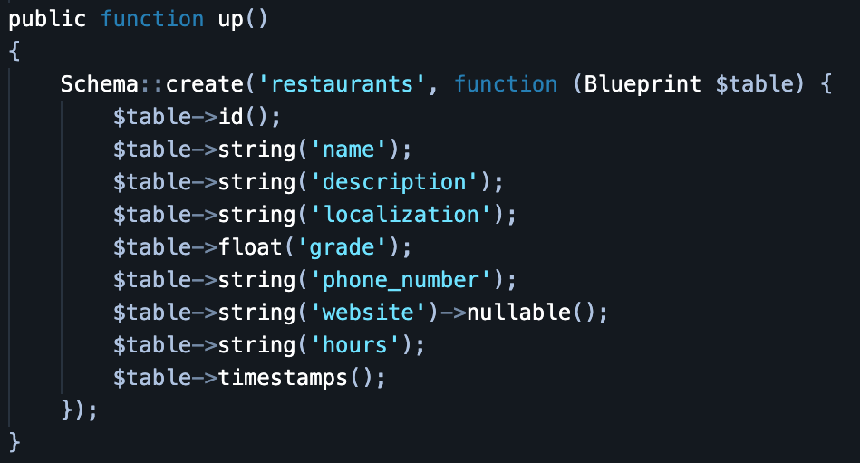

* Model:

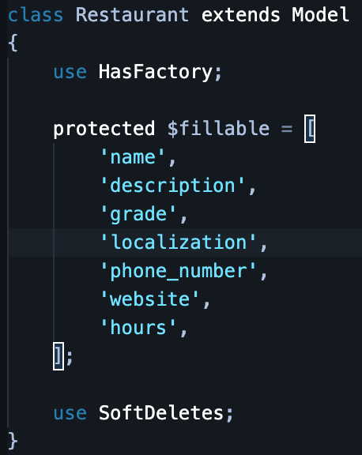

* Seeder:

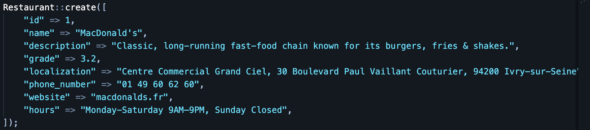

* Route:

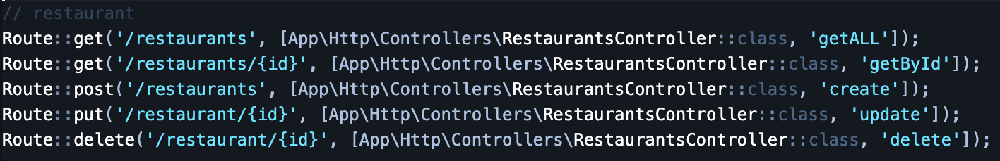

### Jeudi 4 Mars:

#### Objectifs:

Finir le package Menu.

#### Résultats:

* Migration:

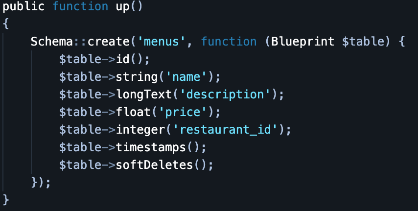

* Model:

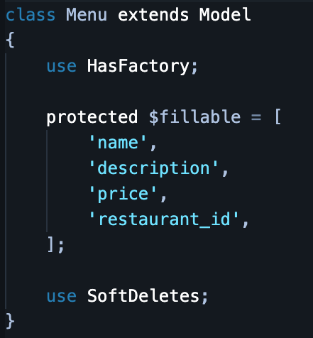

* Seeder:

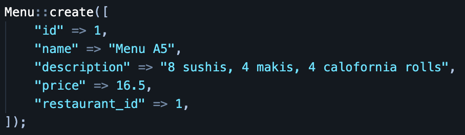

* Route:

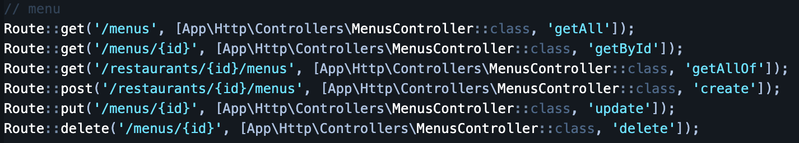

### Vendredi 5 Mars:

#### Objectifs:

Finaliser l'API, creation du README.md, écriture du Suivi en Markdown.

#### Résultats:

API fini avec [README](README.md). 
[Suivie front](Suivi2.md)