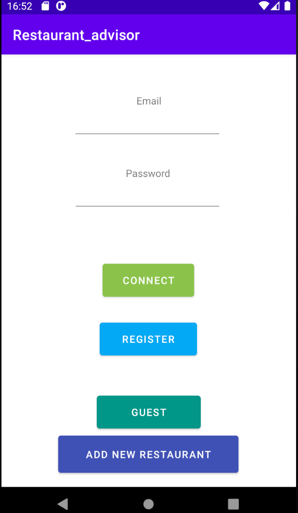
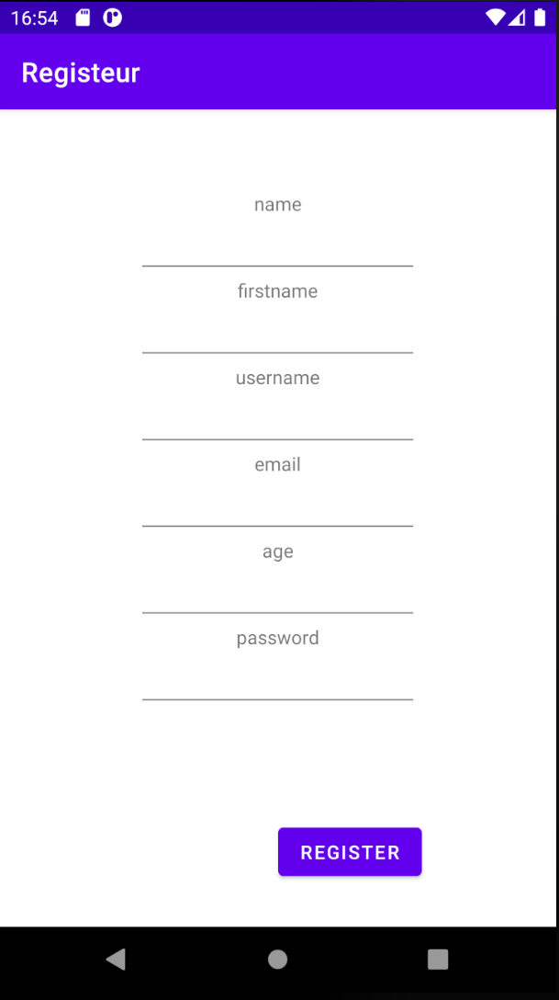
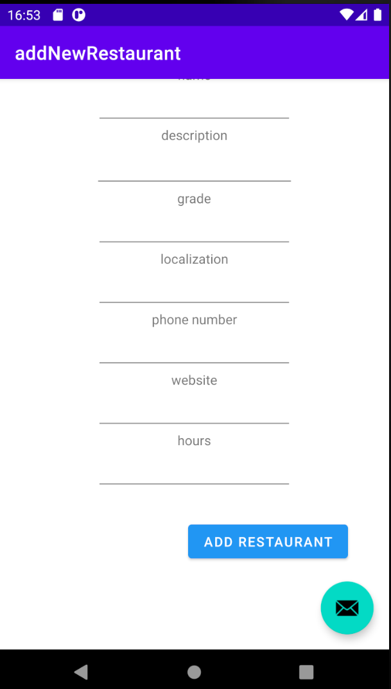
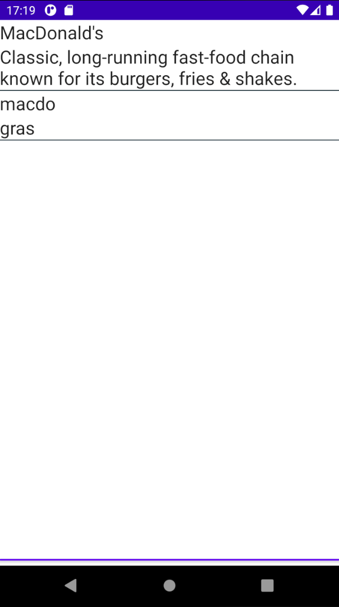
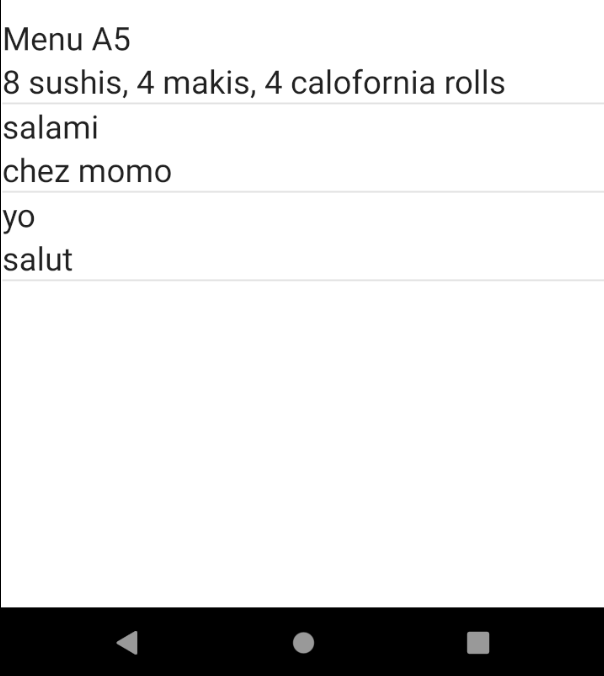
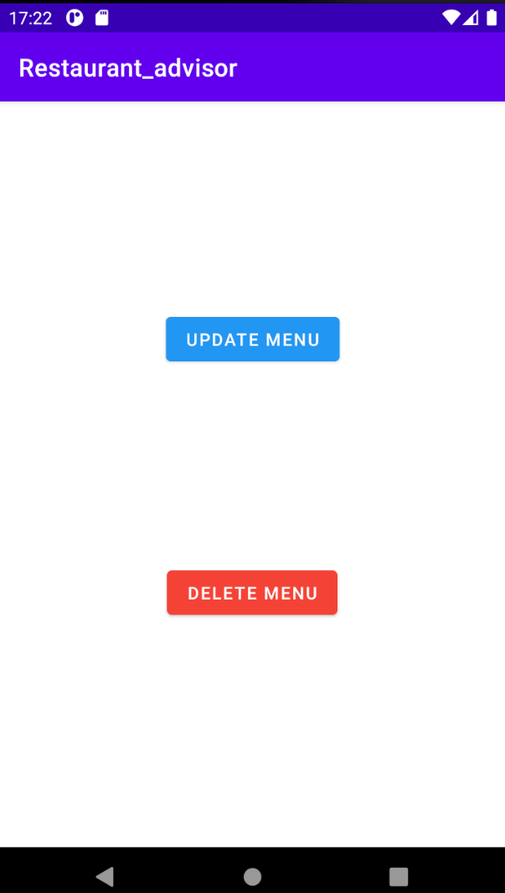
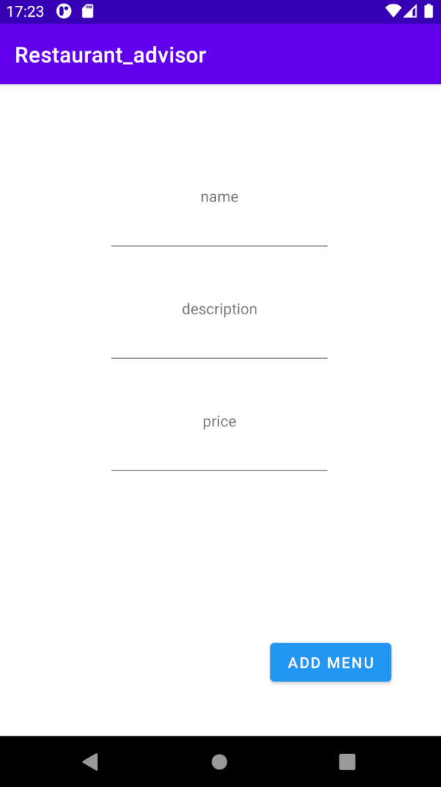
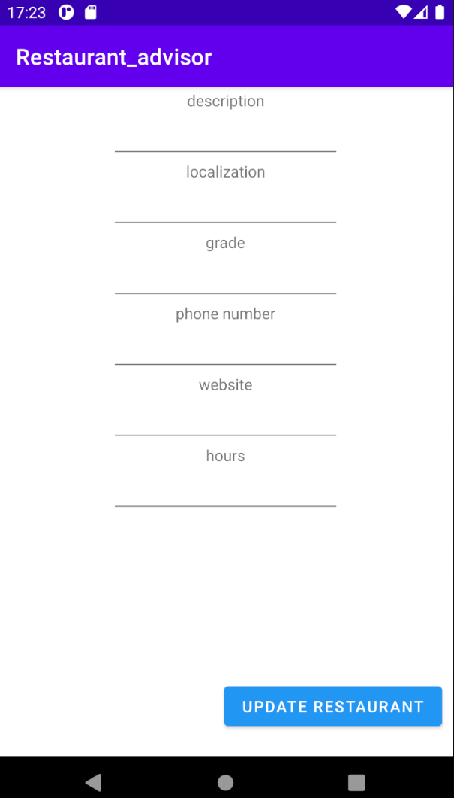

## Suivi journalier:

### Lundi 15 Mars:

#### Organisation de la semaine, répartition des tâches:

Le but de cette semain est d'appliqué ce que nous avons apris dans la semaine précedent.
Nous avons passé la premiére semaine de la partie front à decouvrire les languages pour codé une application mobile,
apres déliberation nous avons choisie de partie sur une aplication android en java.

pour l'organisation nous avons decidé de se répartire les taches simplement, un qui s'occupe du visuel l'autre du code.

### Mardi 16 Mars:

#### Objectifs:

Créé la page d'acceuil simple permettant de se connecté, créé un nouveau restaurant, créé un compte, ou juste decouvrire les restaurants.

#### Résultats:

### Mercredi 17 Mars:

#### Objectifs:

Cette journée fue réservé à la création des listes de restaurants et de menus.

#### Résultats:

### Jeudi 18 Mars:

#### Objectifs:

Durant cette journée le but est de finalisé l'application et de corrigé si possible le bug de la requéte PUT de l'api.

#### Résultats:

### Vendredi 19 Mars:

#### Objectifs:

Finaliser l'application, creation du README.md, écriture du Suivi en Markdown.

#### Résultats:

[Application](/MyApplication) fini avec [README2.md](README2.md). 

## Auteurs

[Sid-Ahmed NOUAR Linkedin](https://www.linkedin.com/in/sid-ahmed-nouar-4347b5159/)

[Hary Rafalimanana Linkedin](https://www.linkedin.com/in/hary-rafalimanana-776333203/)

## Version

* 1.0
    * Version initial

## License

Ce projet est en opensource, lire le CGG de ETNA school Paris.